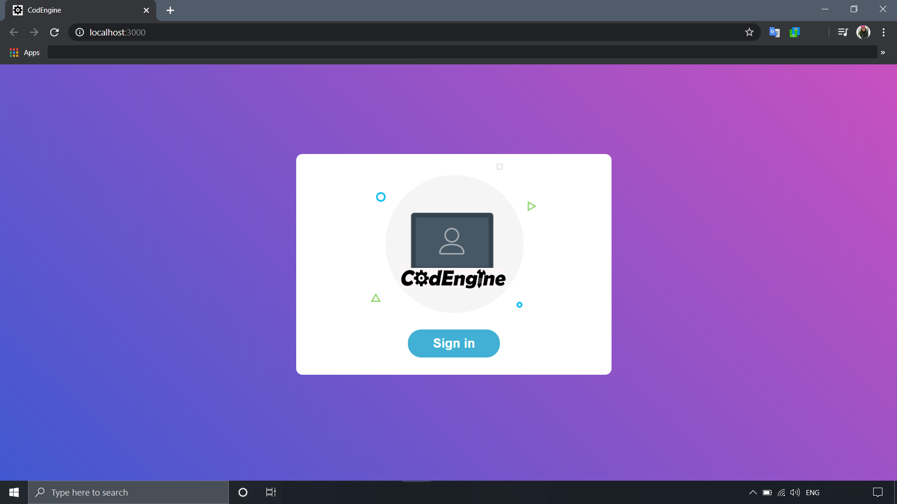
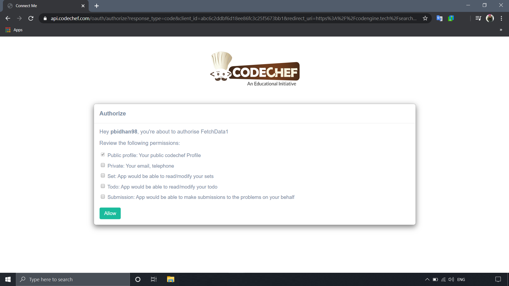
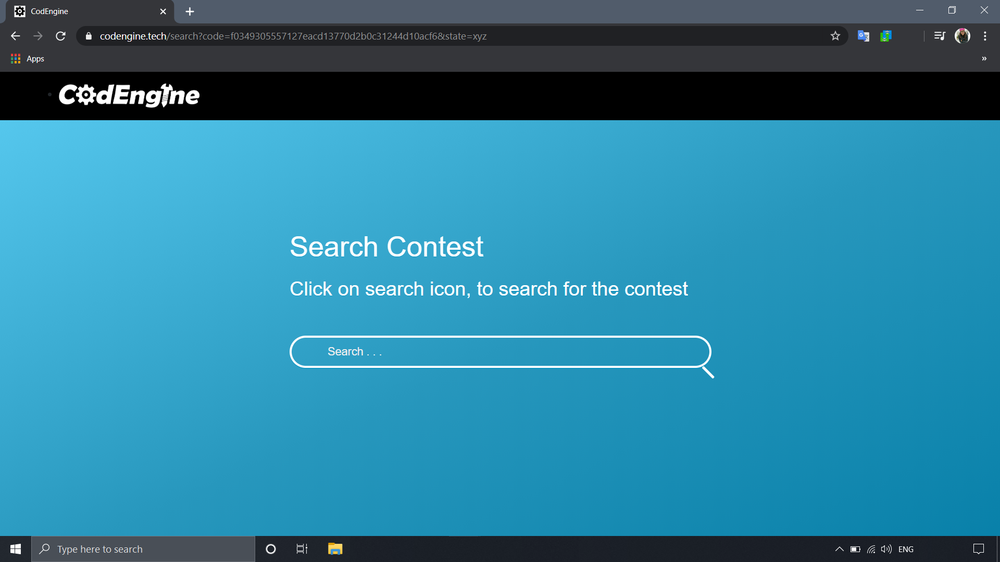
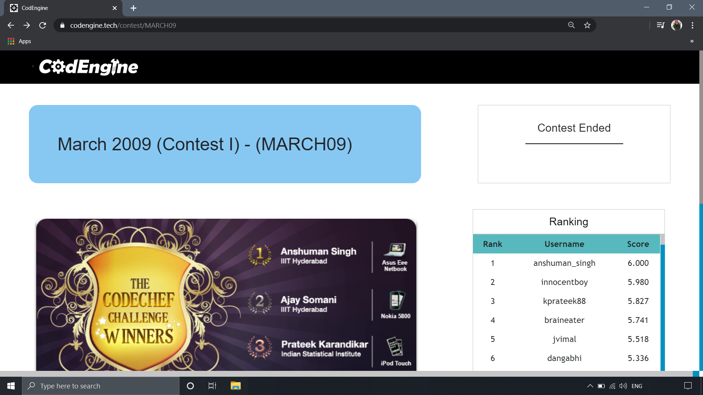
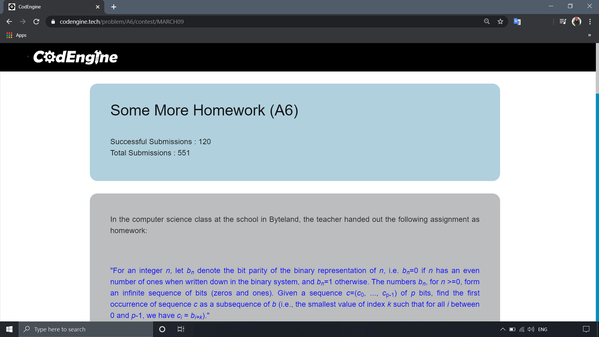
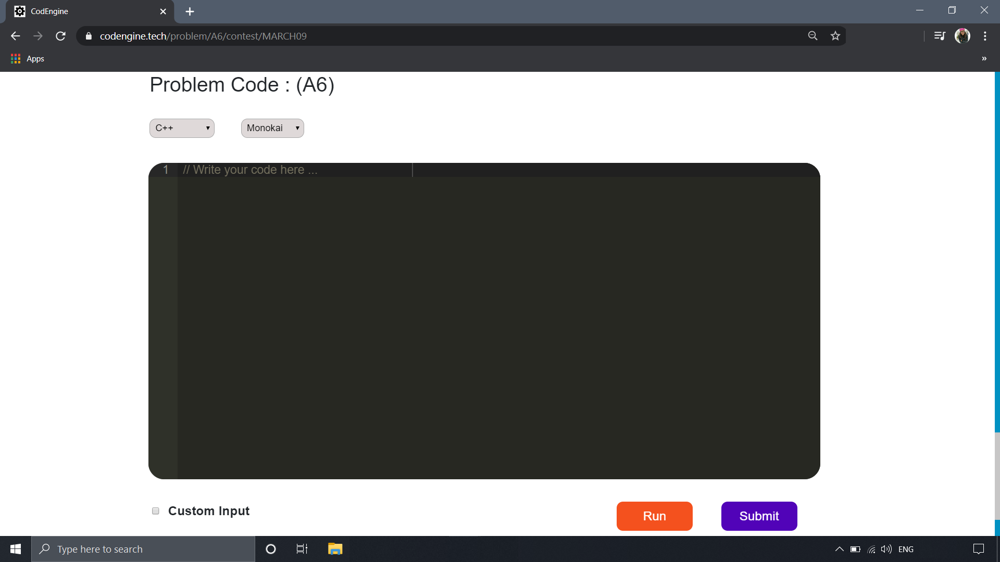

This project is an oline judge that uses Codechef API and created for making an interative and simple UI.
 
# Front Page of Website

 

 

# Authentication using Codechef API

 

 

# Search the Contest 

 

 

# Select a contest and got to the contest page where problems are listed

 

 

# Select a problem statement

 

 

# IDE for writing the source code and checking it's execution and output by pressing RUN and SUBMIT button respectively.

 

Happy Coding!!!
